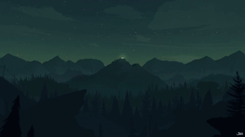

  

## realistic-dynamic-firewatch-wallpaper

Wallpaper fetches sunrise, sunset, and noon times from [Sunrise Sunset API](https://sunrise-sunset.org/api) and cycles through various firewatch art (None of them are mine) as the day progresses.

## Installation
Subscribe to it on [Steam](https://steamcommunity.com/sharedfiles/filedetails/?id=3042208232).

## Credit
Massive thanks to both [Sean Lennaerts](https://github.com/seanlennaerts) and [Cave](https://steamcommunity.com/profiles/76561198250142868). Their projects were used as a base and guide to build this.
Please go check out their projects below:

https://github.com/seanlennaerts/firewatch-dynamic-wallpaper/tree/master
https://steamcommunity.com/sharedfiles/filedetails/?id=1687241265

Also, go check out [Daka](https://www.artstation.com/artwork/1VBvq) since I used his awesome Firewatch timelapse images!
